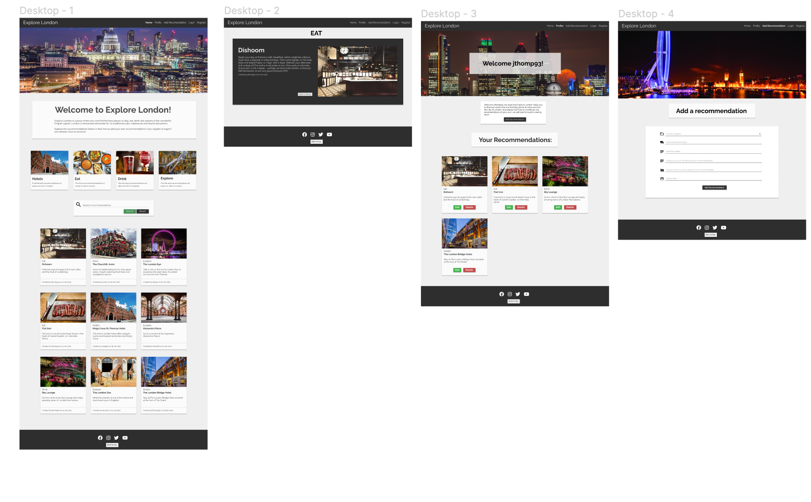
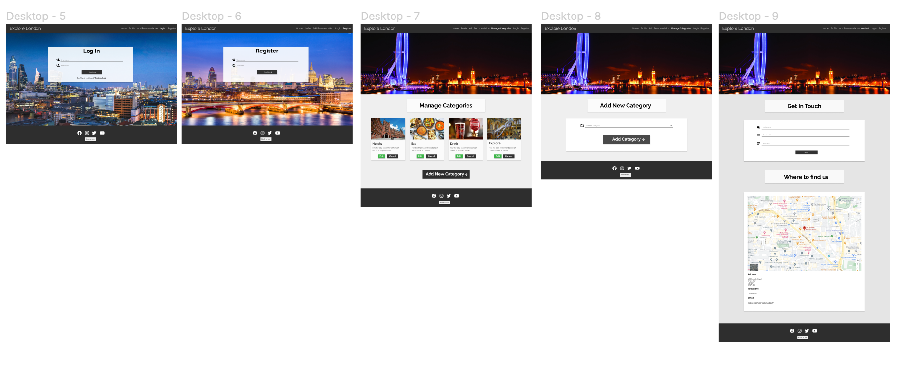
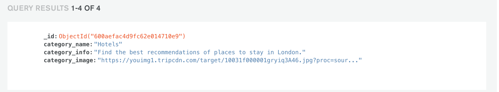
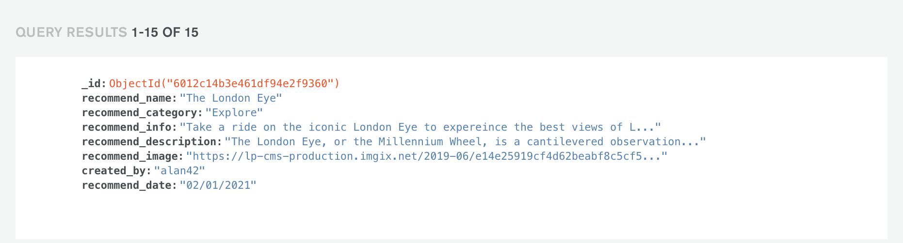
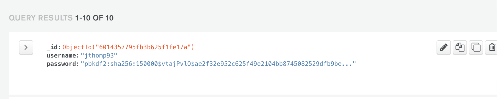

# Milestone Project 3 - Explore London 
View the live project here 

***
## **What is the purpose of this project?**
Explore London is an app that aims to provide a platform where users are able to discover the best places to stay, eat and
drink as well as the best things to do in the capitol. The app will enable users to register and create their own account where 
they will be able to add their own recommendations to the website as well as edit and delete them if they wish to do so. 

The app is aimed at a wide range of users, from locals who live in the city, to tourists who are visiting London for the first time and want 
plan what they are going to do during their stay in the city. 

The main aim for me was to create an app that had an intuitive user interface and created a sense of community amongst its users. 

This project was my third Milestone Project as part of the Diploma in Software Development at Code Institute.

## **User Experience**

## User Stories 

Before I began the design proccess for my project I created the following user stories. This really helped me understand more 
about the kind of users the website may attract and how I could go about desinging an interface that would satisfy their needs. 

### **Project Stakeholders** 

* Being the creator of the Exlpore London app I am the main project stakeholder so it was in my best interest to provide 
a platform that staisfied all potential users needs through an intuitive user interface that is easy on the eye and simple to navigate 
which in turn should encourage users to return to use the app again. 

### New users 

* I am user who is going to being visiting London for the first time. I want to use an app which will enable me to 
plan my entire trip. I am wanting to find the best place for me stay, places to eat and drink and things to do during my visit.

* I am a user who currently lives central London. Me and my partner have been drinking in the same pub for years and have decided 
we want to start exploring some of the other pubs in London. I want to find an app where I can find recommendations for the best pubs to go to. 

* I am a user who lives in London. I have two children and the summer holidays are approaching so I am wanting to find an app that 
will help me find some new and exciting things for us to do. 

### Returning Users 

* I am a user who has the been using the app over the last few months. I recently ate out at an amazing resteraunt in Shoreditch
so i have returned to add it to the app as a new recommendation. 

* I am a user who visits London every summer. Last year I planned my trip using the app which was fantastic so I have returned 
again this year to plan my upcoming trip. 

* I am a user who regularly travels to London on business. I always use the app to keep up to date with the best places to stay
in London whilst I am on my business trips. 

### Mobile user 

* I am a user who wants to use the app on my mobile device. I want it to be intuitive to use as well as the information being presented 
in a clear and organised fashion. 

## **Design Proccess**

### UX Research 

Before I began the initial design proccess of my project I took some time to research some other websites that are providing a similar 
service to what I want my app to provide. The main things I was looking for was the way in which these platforms presented their information
and how they enabled their users to add their own content. 

The following web pages helped give me inspiration to beign designing my own project. 

* https://www.tripadvisor.co.uk/
* https://gregory4321.github.io/milestone-project-2/

## **UX Design**

### The Strategy Plane

After spending some time researching similar websites it became apparent to me that there were plenty of recommendation websites 
out there but none really that were specifally for London and that enabled users to add their own content. This made me realise 
that were was an audience of users who's needs were not currently being met. With this in mind it was apparent to me that there
was a gap in the market for this app and that if I carefully design it with these users in mind, the app could potentially be 
a great success.

### The Scope Plane 

With the general idea for the app in place it was time for me to begin planning what features the webstie would have. It 
was clear to me that the app would need to have full CRUD functionality to give the best user experience. This would enable users
to create content, read content, update their own content and also delete content if they wished to do so.

I decided that each user would be directed to their own profile page after logging in where they would be presented with a
welcome message. The app would also have a contact page that would enable users to get in touch with us as well as being able 
to see where our office locations are.

It was also very important to me that the app was as intuitive to use for the user as possible. This was achieved through a fixed 
nav bar that enables the user to navigate to any page on the website at any time. At the bottom of each page there is a back to 
top button which enables the user to return back to the top of the page that they are currently viewing. 

### The Structure Plane 

It was now time for me to begin planning how the features of the app were going to be structured. As the main concept behind
the app is users giving recommendations, I decided that these should be on the main page for the website.
So the home page is where all of the recommendations are displayed. The users would be able to filter these by category or if they want
they will be able to search the recommendations. 

I decided that cetrain pages would only be availble to users who are registered and logged in, but I still wanted users who weren't logged in 
to be able to view the recommendations. 

The users profile would be the place where they are able to view all of their own recommendations as well as being able to edit and delete them. 
On the users profile they would also be presented with the opportunity to add their own recommendation which would direct to the form to do so. 

The Admin for the website would be able to access an additional page which would allow them to add new categories to the app
as well as edit and delete them. 

### The Skeleton Plane 

With the main concept now in place for my app it was now time to start thinking about how the users will use and get around the app 
and ensure that it meets the needs of it's target audience. As mentioned previusly all users whether they are logged in or not would be presented 
with the home page where they will be able to read all of the recommendations. Each recommendation can be clicked on which present the user
with the full details about that paticular recommendation. From here the user can click the Back To Home button to return to the home page.  

If users decide to, they can access the register page from the nav bar to create their own profile. After regsitering the user will be redirected 
to their profile where they will be presented with a welcome message and the opportunity to add their first recommendation. 
To add a recommendation the user will be presented with a form where they can add the category, name, brief description, full details, image and the date, 
then they will be redirected back to their profile where they will be able to see their recommnedation and will be 
edit or delete it if they wish to do so.

On the contact page the user is presented with a form which enables them to present their own credentials and send a message to 
the Explore London team. Below this the user is presented with the an intuitive Google Maps API which allows the users to drop markers onto
the map to see the office locations as well as being presented with the office details. 

### The Surface Plane

I decided to keep the colour scheme for the app as simple as I could to make sure it wasn't to distracting and enabled the users 
to focus more on the actual content of the website. It was now time for me to start designing my wireframes using Figma. This really helped 
me bring my ideas to life and plan exactly what the structure of the website was going to look like. 

I decided that I wanted each page to contain a hero image section as I beleive that these are a very positive thing 
for the user to be presented with when landing on a page, they look professional and give the user a good first impression when 
arriving on a paticular page. 

I used Google fonts to select the fonts for the app and I decided to use the Raleway font and I used Sans Seriff as a back up font should this fail to 
load correctly. 

I used font awesome throughout the website for various icons which are predominantly used on buttons. 

## **The Design Proccess**

Colour Pallette:

Wireframes

[You can view the Figma wireframes project here](https://www.figma.com/file/vjVx7MI3YPWt23be1YY93j/Milestone-Project-3?node-id=0%3A1)

[Back to Top](#table-of-contents)
 
## **Features**

### Existing features

* Navbar - Materialize was used to create the Navbar for the website which is featured accross all pages on the website. the Navbar is fixed 
to the top of the page allowing the user to access all pages at all times. On small screen sizes the Navbar collapsies into a side nav bar. 

* Hero images - Most of the pages accross the website feature hero images at the top of the page. These are visually pleasing and help draw in
the users attention. 

* Footer - The footer section is featured on all pages accross the website and has links to the website social media links. 
As I don't actually have social media set up for the website these links just direct the user to that paticular social media website. 

* Home Page - The home page is the first place users arrive when visiting the website. It contains a hero image at the top of the page proceeded by 
a message welcoming users to the website. The main content of the home page is all of the recommendations that users have added to 
the website. There is a section which displays the categories of the recommendations which the users can use to filtet the recommendations
and also a search bar which allows the users to search the recommendations. 

* Profile Page - This page is only available to users who have created an account. After logging in users will be redirected to their own profile 
page and will be presented with a welcome message. The profile page will display all of the users recommendations and will give them 
the opportunity to edit or delete them. 

* Add Recommendation Page - This page contains a hero image at the top of the page followed by a form which enables the user to add their own recommendation
to the website. 

* Contact Page - This page contains a hero image at the top of the page followed by a form which enables the user to give their details 
and send an email to the team at Explore London. After this the user is presented with a Google Map which allows the user to select an office and a marker 
will be dropped onto the map to display the location. The full details for that paticular office will then be displayed below the map. 

* Login Page - This page contains a full screen background image and a form which allows the user to enter their details and 
login into their acount. If the user enters an incorrect username or password they will be redirected to the login page and a flash message will
be displayed informing them their details were incorrect. 

* Register Page - This page contains a full screen background image and a form which allows a user to enter a username and password to create their 
account. If the username already happens to exist the user will be redirected to the register page and a flash message will be displayed 
informing the user that the username they chose already exists. 

* Logout functionality - The log out button removes the user from the current session and redirects them to the login page displaying a flash message 
informing them that they have been logged out. 

* Manage Categories Pages - This page is only accessible to the Admin for the website. This gives the Admin the capacity to add, edit and delete categories. 

### Future releases 

* I would like to add functionality so that users could add a google map to their recommendation displaying the location. 

* I would like to give the users the opportunity to be able to update their password from their profile page. 

* I would like to add the EmailJS functionality so that when users register they recieve an email informing them 
that their account has been created. 

[Back to Top](#table-of-contents)

## **The Database Structure**

All of the data for my project is stored in a MongoDB database. The database is made up of 3 collections that are as follows:

* Categories - This collection stores the data for the categories of the recommendations. It consists of the category name, 
categoery information and the category image. 

* Recommendations - This collection contains the data for each of the recommendations that are added to the website. It consists of the 
the recommendation name, category, information, description, image, who the recommendation was created by and the date the recommendation
was created. 

* Users - This collection stores the username and password of the users when they create their account. the password is hashed using 
flasks werkzeug for additional security measures. 

## **Technologies Used**
***

### Languages 

* [HTML5](https://en.wikipedia.org/wiki/HTML5) - HTML5 was used to build the core structure of the website.
* [CSS3](https://en.wikipedia.org/wiki/CSS) - CSS3 was used to style the HTML5 elements.
* [JavaScript](https://en.wikipedia.org/wiki/JavaScript) - JavaScript was used to provide interactive functionality.
* [Python](https://www.python.org/) - Python was used to build the app and back end functionality. 

### Libraries, frameworks, databases and editors

* [Materialize](https://materializecss.com/) - Materialize was used to create many of the compnenets throughout the website. I particularly made use of their CSS grid system to make my website responsive. 
* [EmailJS](https://www.emailjs.com/) - EmailJS was used to enable the user to send an email from the contact page. 
* [Font Awesome](https://fontawesome.com/) - This was used to import the arrow symbol use on the buy tickets link on the Live page. 
* [Github](https://github.com/) - This was used to store the repository for my website and host it on Github pages.
* [Git](https://git-scm.com/book/en/v2/Getting-Started-About-Version-Control) - Throughout the development of my website I made use of Git version control to ensure all changes and additions to my code were added to the repository. 
* [Gitpod](https://gitpod.io/) - This was used to write all code for the website. 
* [JQuery](https://jquery.com/) - I used JQuery to write some of the Javascript code for the website. 
* [Google images](https://www.google.com/imghp?hl=EN) - This was used to find all of the images for the website.
* [MongoDB](https://www.mongodb.com/3) - I used MongoDB to store all of the data for my project. 
* [Flask](https://flask.palletsprojects.com/en/1.1.x/) - The Flask framework was used together with the Python code in this project. 
* [Jinja](https://flask.palletsprojects.com/en/1.1.x/templating/) - Jinja was used for template inheritence and to connect the backend to the front end. 
* [PyMongo](https://pymongo.readthedocs.io/en/stable/) - This Python API helped me to connect the back end and front end. 

### Tools 

* [Adobe Photoshop](https://www.adobe.com/uk/products/photoshop.html) - This was used to resize images.
* [Am I Responsive](http://ami.responsivedesign.is/) - This was used to show how my website is responsive across all screen sizes. 
* [Free Online HTML Formatter](https://www.freeformatter.com/html-formatter.html) - This was used to format my HTML code to improve readability. 
* [Free Online CSS Formatter](https://www.freeformatter.com/css-beautifier.html) - This was used to format my CSS code to improve readability.
* [Free Online JavaScript Formatter](https://www.freeformatter.com/javascript-beautifier.html) - This was used to format my Javascript code to improve readability.
* [Figma](https://www.figma.com/) - This was used to create the wireframes. 
* [Google](https://www.google.com/) - Google was used extensively throughout the design and development process for images, researching solutions to coding issues and information to use in my website. 
* [Google maps](https://www.google.co.uk/maps/) - This was used to get the coordinates of the music venues. 
* [Google developers](https://developers.google.com/) - This was used to implement the Google Maps API. 
* [Coloors.co](https://coolors.co/ed6a5a-f4f1bb-9bc1bc-e6ebe0-36c9c6) - I used this to generate the colour scheme for my project. 

[Back to Top](#table-of-contents)

## **Testing**

The testing for this project can be found [here]()

## **Deployment**
***

The deployed project can be viewed [here]()
The projects GitHub repository can be viewed [here]()

### Cloning 

If you would like to deploy your own version of my project and develop it even further use the following steps:

1. Visit my repository on ‘Github pages’

2. Click on the green code button

3. If you want to clone the repository using HTTPS, under clone with HTTPS click the folder icons to copy the URL.
* If you want to clone the repository using SSH Key, including a certificate issued by your organization's SSH certificate authority, click Use SSH and click the folder to copy the URL. 
* To clone a repository using GitHub CLI, click Use GitHub CLI, then click the folder icon to copy the URL. 

4. Next open your terminal 

5. Then you need to change the directory to the location where you want the cloned directory. 

6. Type git clone followed by the URL that you had copied earlier. 

7. Next press enter to create your local clone. 

8. The next step is you need to create a database for you to use with this cloned repository with MongoDB.

9. Next return to the terminal and enter the following command to install all of the dependencies that are required to run the project. 
* pip install -r requirements.txt

10. Next you need to create an env.py file with the following content. Be sure to replace the appropriate parts with the details of your own MongoDB database. 
* import os
os.environ.setdefault("MONGO_URI", "mongodb+srv://<username>:<password>@<cluster_name>.mj6ld.mongodb.net/<database_name>?retryWrites=true&w=majority")

11. Be sure to add your env.py to a .gitignore file to ensure that this file is not pushed to your GitHub repositiory. 

12. Your repository is now ready to run using the following command. 
* python3 app.py

If you would like to learn more about cloning repositories you can do so from the following [link](https://docs.github.com/en/github/creating-cloning-and-archiving-repositories/cloning-a-repository)

### Deploying to Heroku 

I used the following steps to deploy my project to Heroku: 

1. Firslty I began by creating an account with Heroku. From here I created a new app which prompted to give my app a unique name which is explore-london.
Next I set the region to the nearest one to me which happened to be Europe. 

2. Once i had created the app the next step was to head to the settings tab and click on reveal config vars. From here I entered the following details. 
* IP - 0.0.0.0
* MONGO_DBNAME - explore_london
* MONGO_URI - "mongodb+srv://<username>:<password>@<cluster_name>.mj6ld.mongodb.net/<database_name>?retryWrites=true&w=majority"
* PORT - 5000

(NOTE: You need to change the username, password, cluster name and database name sections within the MONGO_URI to match that of your database however 
I have not shown these above for security reasons.)

3. Next I created a requirements.txt file in my editor with the following command:
* pip3 freeze --local > requirements.txt

4. Next I created a Procfile conatining the following content:
* echo web: python app.py > Procfile

5. I then added and commited these files to my github repository with the following commands:
* git add .
* git commit -m ""

6. The next step was to login into Heroku within the termianl using the following command: 
* heroku login 

7. Next I linked my Heroku app using the following command:
* heroku git:remote -a explore-london

8. Next I went to the Deploy tab in Heroku and enabled automatic deploys from my github master branch. 

9. I then deployed the project by pushing it to Heroku. 

